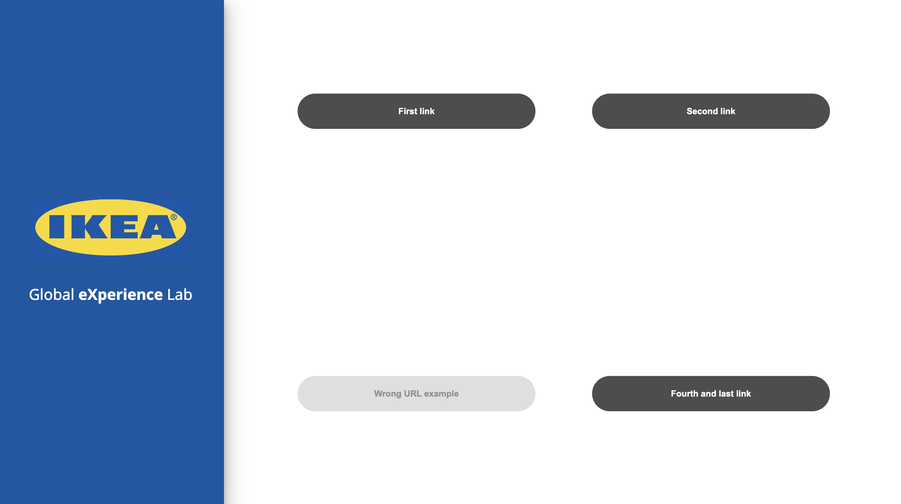
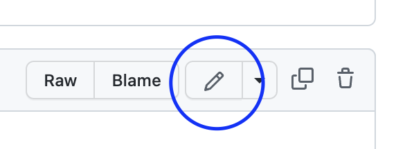

Hej! 👋 This repository holds the data source for the Global **eXperience** Lab's kiosks index application. Any collaborator can add, remove or change the URLs by editing the file `links.json`. If you are not familiar with JSON formatted files, please keep reading.

## 1. What is JSON?
JSON stands for JavaScript Object Notation and consists on a text-based data format in which we find properties paired with values. In our case, properties and values are just strings, are encapsulated between curly braces and separeted by commas. You'll find more information [here](https://developer.mozilla.org/en-US/docs/Learn/JavaScript/Objects/JSON).

## 2. Editing the links file
As you will notice, the "main" property in the `links.json` is called **data**. That part must be unchanged, so the structure of the file always remains like this:
```javascript
{
    "data": [
        // Here is where each link is stored, hence what we will be editing
    ]
}
```
The brackets indicate that the objects contained inside them are a collection, set or array of the same kind (links, in our case). Links are, as we said, encapsulated in what are called objects and each object is delimited by curly braces as follows:
```javascript
{
    "property1": "value1",
    "property2": "value2"
}
```

If we have more than one object, we simply separate them by commas. The next example uses real properties and values:
```javascript
{
    "label": "First link",
    "href": "https://github.com/agher1/xlab-links/blob/main/links.json"
},
{
    "label": "Second Link",
    "href": "https://github.com/agher1/xlab-links"
},
{
    "label": "Wrong URL example",
    "href": "httos:www.ikea .com/"
},
{
    "label": "Fourth and last link",
    "href": "https://www.ikea.com/"
}
```
⚠️ **Important**: _note that both the href property lines and the last object aren't followed by a comma. That is because they are the last property and object, respectively._ 

## 3. How this translates to the kiosk
The following image shows how those previous object would be rendered in the web application. When the link URl is not valid, the button will appear as disabled (in this case, there wa's a typo in the protocol as well as an space in the middle of the link):



## 4. Adding more links
Here we have the initial version of the file in this example.
```javascript
{
    "data": [
        {
            "label": "First link",
            "href": "https://github.com/agher1/xlab-links/blob/main/links.json"
        },
        {
            "label": "Second Link",
            "href": "https://github.com/agher1/xlab-links"
        },
        {
            "label": "Wrong URL example",
            "href": "httos:www.ikea .com/"
        },
        {
            "label": "Fourth and last link",
            "href": "https://www.ikea.com/"
        }
    ]
}
```

To edit the file directly from the browser, simply go to the [links.json](https://github.com/agher1/xlab-links/blob/main/links.json) file and then click the edit button to enable the text editor.


After adding two more links, the result would look like this:


To save those changes, the final step would be to click the _Commint changes_ button, at the bottom of the page:


And it would be displayed as you can see here:


## 5. Common mistakes
The following situations will cause the application to fail when retrieving the links' data:

  - Spaces or invalid characters in the `href` value,
  - not closing curly braces in each object,
  - not separating properties or objects with commas,
  - deleting the `data` keyword from the root or main property

---

Thank you and feel free to reach me at agustin.hernandez@ingka.ikea.com for any inquiries, comments or doubts.